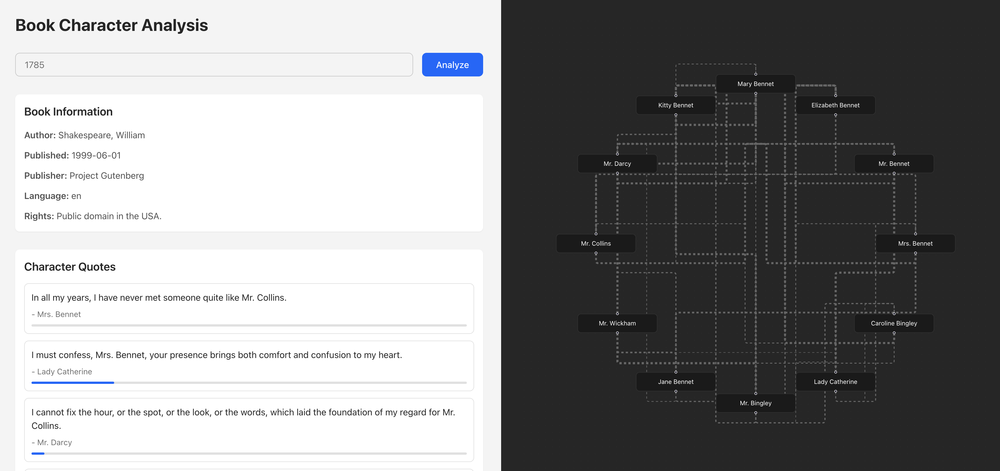

# React & LLM API

Web app to analyze and visualize character interactions in Project Gutenberg e-books using LLM.


## Overview

This project is a React-based single page application, styled using TailwindCSS, that allows users to explore and analyze character interactions in Project Gutenberg e-books. The application leverages a Language Learning Model (LLM) to process the text of e-books and visually represent character interactions through an interactive network graph.

The application is deployed on AWS using the AWS Cloud Development Kit (CDK), which automates the setup of AWS Lambda for backend processing and API Gateway for handling requests efficiently. This deployment strategy was chosen to take advantage of AWS's free tier, making it cost-effective and scalable.



## Notes

- To avoid high expenses associated with real LLM processing, this project uses mocked results.
- Avoids complex asynchronous tasks like workers or Kafka by simulating a job submission API to minimize latency.
- Utilizes AWS Lambda and React to keep costs low, leveraging AWS's free tier for cost-effective scalability.
- No authentication or authorization is implemented in this prototype.
- CORS is not enforced properly, in order to keep the project simple.
- No testing is implemented, in order to keep the project simple.
- The API host is hardcoded in the frontend, in order to keep the project simple.
- Prompt engineering is not part of this prototype, to keep it within 1 hour of coding.

## References

- [React Flow](https://reactflow.dev/learn)
- [Guternberg Org](https://www.gutenberg.org/ebooks/1787)

## Setup

Install the dependencies using the following command:

```bash
yarn install
```

To run the React app locally, simply run:

```bash
yarn dev
```

## Build

Build the app with the following command:

```bash
AWS_PROFILE=myprofile yarn build
```

## Deploy

Deploy the app using AWS CDK using the following command:

```bash
AWS_PROFILE=myprofile yarn deploy
```

## Test

To run the integration tests, run the following command:

```bash
yarn test
```

## Troubleshooting

To view the API logs, run the following command:

```bash
yarn run logs
```
